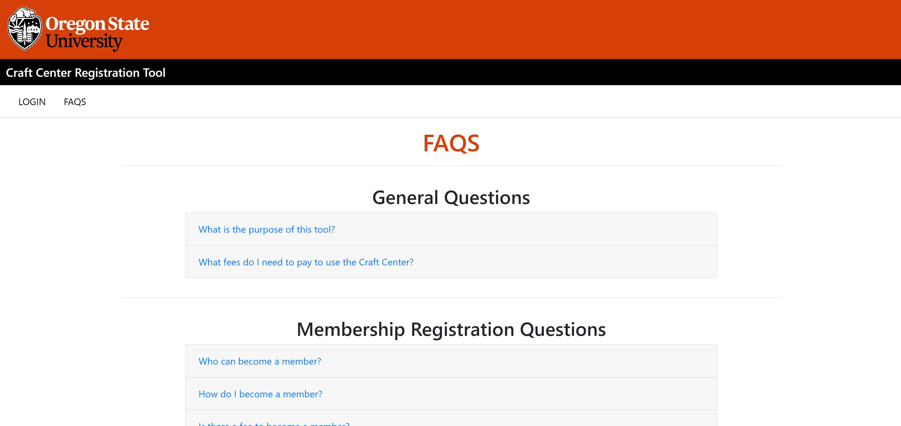
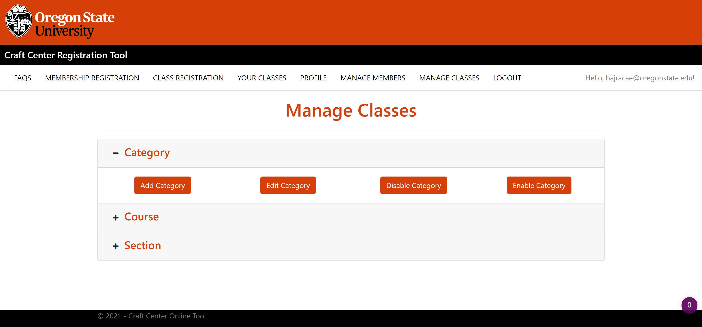

# OSU Craft Center Online Tool

Welcome to the information page for the OSU Craft Center Online Tool project. The OSU Craft Center Online Tool is a website that allows OSU students to register for membership and classes at the OSU Craft Center without having to physically visit its front desk.

### **Initial Project Video and Demo**

---

### **Login**
### **We used OSU's SSO Login feature to allow current students, facult and other OSU affiliated public to access our Project.**

---

### **FAQ**
### **This page represents frequently asked questions and how to use our project.**

---

### **Membership**
### **This allows users to fill out the membership form for Craft Center and the application saves it to the database.**

---

### **Class Registration**
### **This page allows user to navigate through different Categories, Courses and Section for their desired class and register for it.**

---

### **Your Classes**
### **This page represets users on which class they are registered for.** 

---

### **Profile**
### **This page represents information that a user used for their membership.**

---

### **Manage Members**
### **This page allows Craft Center employees to manage members and look details for each member**

---

### **Manage Classes**
### **This page allows Craft Center employees to manage Categories, Courses and Sections.**

